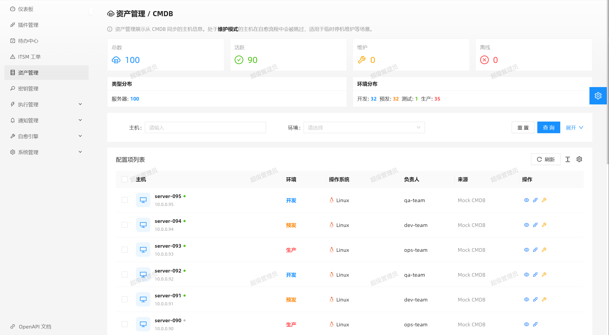
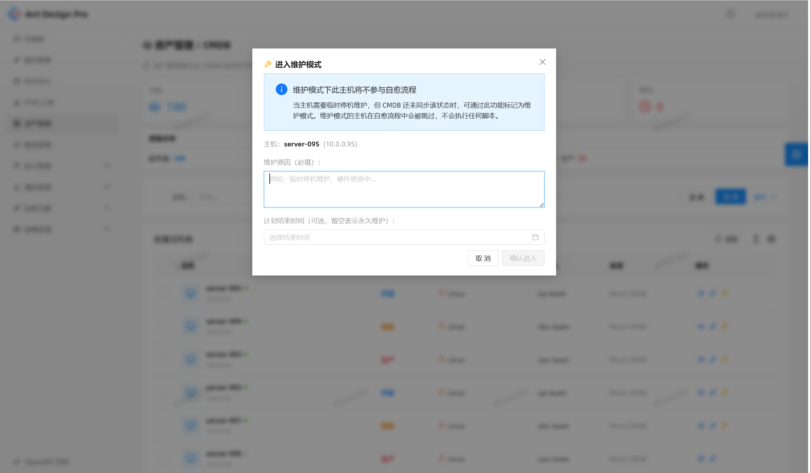
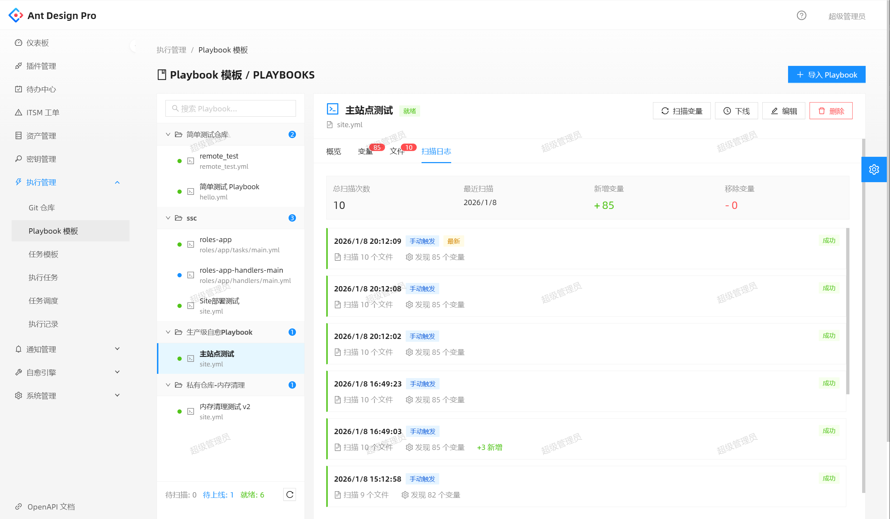
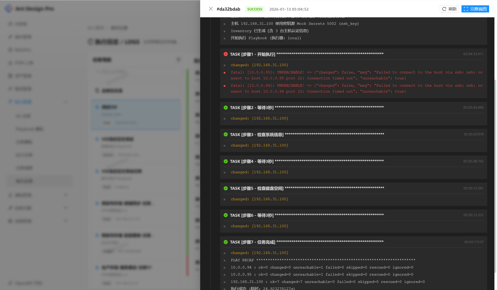
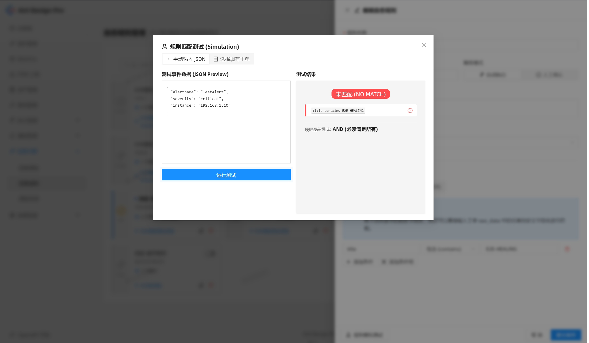

<p align="center">
  
</p>

<h1 align="center">Pangolin — 智能运维自愈平台</h1>

<p align="center">
  <strong>企业级智能 IT 运维自愈平台</strong>
</p>

<p align="center">
  <a href="https://github.com/heyangguang/auto-healing/releases"></a>
  <a href="https://github.com/heyangguang/auto-healing/blob/main/LICENSE"></a>
  <a href="https://goreportcard.com/report/github.com/heyangguang/auto-healing"></a>
  
  
  
  
</p>

<p align="center">
  <a href="#-快速开始">快速开始</a> •
  <a href="#-核心功能">核心功能</a> •
  <a href="#-系统架构">系统架构</a> •
  <a href="#-部署指南">部署指南</a> •
  <a href="#-使用手册">使用手册</a> •
  <a href="#-参与贡献">参与贡献</a>
</p>

<p align="center">
  <a href="./README.md">English</a> | <a href="./README_zh-CN.md">简体中文</a> | <a href="./README_ja.md">日本語</a>
</p>

---

## 🌟 项目简介

**Auto-Healing Platform（AHS）** 是一个开源的企业级智能化 IT 运维自动化自愈平台。它将监控告警（ITSM 工单）、资产配置（CMDB）、自动化脚本（Ansible Playbook）和审批流程有机整合，构建从 **"发现问题 → 智能匹配 → 自动执行 → 全链路追溯"** 的一体化运维闭环。

> **让系统在人睡着时，也能智能、安全、可追溯地解决问题。**

```
┌─────────────┐     ┌──────────────────┐     ┌────────────────────┐     ┌──────────────────┐
│  外部 ITSM   │────▶│   告警接入与解析   │────▶│  智能规则匹配引擎   │────▶│  自动执行 + 审批   │
│   监控系统    │     │  (Plugin 集成)    │     │  (Healing Rules)   │     │  (DAG 流程编排)    │
└─────────────┘     └──────────────────┘     └────────────────────┘     └──────────────────┘
                                                                                 │
                              ◀────────── 全链路审计日志 & 实时 SSE 推送 ────────┘
```

### 💡 为什么选择 Auto-Healing？

| 挑战维度 | 传统方案 | Auto-Healing 方案 |
|---------|---------|-------------------|
| **告警洪流** | 每天数千条告警，人工逐一响应 | 智能规则匹配，自动处置 |
| **响应时间长** | 平均故障响应超过 30 分钟 | 自动化修复 **< 2 分钟** |
| **重复劳动** | 磁盘清理、服务重启需人工介入 | DAG 工作流全面自动化 |
| **无审计追踪** | 操作凭经验，知识流失严重 | 不可篡改的法证级日志 |
| **工具孤岛** | ITSM、CMDB、脚本各自为政 | 统一平台，插件化集成 |

---

## ✨ 核心功能

### 🔄 自愈引擎
- **可视化 DAG 工作流编辑器** — 拖拽式构建复杂修复流程
- **9 种节点类型** — 主机提取、CMDB 校验、条件分支、执行、审批、通知、变量设置、循环、计算
- **双模触发** — 自动模式（零介入）和手动模式（审批把控）
- **Dry-Run 沙箱** — 无副作用地模拟执行，投产前充分验证
- **SSE 实时推送** — 节点状态变更延迟 < 200ms

### 🔌 插件集成平台
- **通用 ITSM/CMDB 适配器** — ServiceNow、Jira、Zabbix 或自定义系统
- **可视化字段映射** — 图形化配置外部到内部的字段映射
- **智能过滤引擎** — AND/OR 逻辑组合，按条件筛选同步数据
- **双向写回** — 自愈完成后自动回写工单状态

### ⚡ 执行中心
- **三种触发模式** — 手动发射台、定时计划（Cron）、自愈流程触发
- **Ansible 执行引擎** — Docker / Local 双模式执行器
- **三态结果判定** — 防止主机不可达的"虚假成功"
- **运行时参数覆盖** — 动态注入目标主机和变量

### 🔐 安全与权限
- **RBAC 权限模型** — 资源级 + 操作级精细控制
- **JWT + SAML 2.0** — 双轨认证，支持企业 SSO（ADFS、Azure AD）
- **JIT 自动开户** — SSO 首次登录自动创建平台账号
- **集中式密钥管理** — SSH、API Key、Token 统一管理
- **全量审计日志** — 每笔操作记录操作人归因

### 📊 更多模块
- **CMDB 资产管理** — 3 态生命周期，批量维护窗口管理
- **Git 仓库管理** — 自动同步、分支锁定、漂移检测
- **Playbook 模板** — 递归变量扫描、变更漂移追踪
- **通知管理** — 多渠道（邮件、钉钉、Webhook），40+ 模板变量
- **待办决策中心** — 审批与手动触发的统一工作台
- **分析仪表盘** — KPI 卡片、规则命中分布、趋势可视化

---

## 🏗 系统架构

### 架构总览

```
┌──────────────────────────────────────────────────────────────────────┐
│                          前端 (React SPA)                            │
│    React 19 · Umi 4 · Ant Design 6 · ProComponents · React Flow     │
└──────────────────────────────┬───────────────────────────────────────┘
                               │ REST API
┌──────────────────────────────▼───────────────────────────────────────┐
│                           后端 (Go)                                  │
│    Gin HTTP Router · 分层架构                                         │
│    Handler → Service → Repository → Database                         │
│                                                                      │
│    ┌────────────────┐  ┌───────────────┐  ┌────────────────────────┐ │
│    │  自愈引擎       │  │ 插件适配器     │  │ 执行引擎               │ │
│    │ (DAG Executor) │  │ (ITSM/CMDB)   │  │ (Ansible Runner)      │ │
│    └────────────────┘  └───────────────┘  └────────────────────────┘ │
│    ┌────────────────┐  ┌───────────────┐  ┌────────────────────────┐ │
│    │ 认证 (JWT+SAML)│  │ 通知引擎      │  │ 后台调度器              │ │
│    └────────────────┘  └───────────────┘  └────────────────────────┘ │
└──────────────────────────────┬───────────────────────────────────────┘
                               │
┌──────────────────────────────▼───────────────────────────────────────┐
│                            数据层                                    │
│    PostgreSQL (JSONB · TIMESTAMPTZ · UUID 主键 · 分区索引)            │
│    Redis (缓存 & 消息队列)                                            │
└──────────────────────────────┬───────────────────────────────────────┘
                               │
┌──────────────────────────────▼───────────────────────────────────────┐
│                            执行层                                    │
│    Ansible Engine (Local / Docker 双模式)                              │
│    SSH 凭证安全注入 · Jinja2 变量渲染                                   │
└──────────────────────────────────────────────────────────────────────┘
```

### 技术栈

| 层级 | 技术 | 说明 |
|------|-----|------|
| **语言** | Go 1.24+ | 高性能、低内存占用 |
| **Web 框架** | Gin | Go 生态最快的 HTTP 框架 |
| **ORM** | GORM | 功能完善，支持 JSONB 复杂查询 |
| **数据库** | PostgreSQL 15+ | JSONB、UUID、TIMESTAMPTZ 原生支持 |
| **缓存** | Redis 7+ | 缓存与消息队列 |
| **认证** | JWT + SAML 2.0 | 双轨认证，企业 SSO 支持 |
| **实时通信** | Server-Sent Events | 轻量级单向推流 |
| **表达式引擎** | expr-lang/expr | 高性能 Go 表达式求值 |
| **自动化** | Ansible 2.14+ | 基础设施自动化引擎 |
| **前端框架** | React 19 + Umi 4 | 企业级插件化 React 框架 |
| **UI 组件** | Ant Design 6 | 成熟的企业 UI 生态 |
| **流程可视化** | React Flow (xyflow) | 专业 DAG 可视化编辑器 |

### 核心数据模型

```
incidents ──────────▶ healing_rules ──────────▶ healing_flows
    │                                                │
    │                                          nodes (JSONB)
    │                                                │
    └──▶ flow_instances ◀────────────────────────────┘
              │
              ├──▶ approval_tasks
              └──▶ flow_execution_logs

plugins ──────▶ incidents
plugins ──────▶ cmdb_items

git_repositories ──────▶ playbook_templates ──────▶ execution_task_templates
                                                          │
                                               execution_runs ──▶ execution_logs
                                               execution_schedules
```

### 项目目录结构

```
auto-healing/
├── cmd/
│   ├── server/                  # 应用入口
│   └── init-admin/              # 管理员初始化工具
├── internal/
│   ├── config/                  # 配置管理
│   ├── database/                # 数据库连接与迁移
│   ├── engine/                  # 执行引擎 (Ansible)
│   ├── git/                     # Git 操作
│   ├── handler/                 # HTTP 处理层 (DTO)
│   ├── middleware/              # HTTP 中间件
│   ├── model/                   # 数据模型
│   ├── notification/            # 通知提供者
│   ├── pkg/                     # 内部公共包
│   ├── repository/              # 数据访问层
│   ├── scheduler/               # 后台调度器
│   ├── secrets/                 # 密钥提供者
│   └── service/                 # 业务逻辑层
├── migrations/                  # SQL 迁移文件 (up/down)
├── configs/                     # 配置模板
├── deployments/
│   ├── docker/                  # Docker Compose 部署
│   └── kubernetes/              # Kubernetes 部署清单
├── docker/
│   └── ansible-executor/        # Ansible 执行器镜像
├── docs/                        # 文档与截图
├── tools/                       # 开发工具和 Mock 服务
└── tests/                       # 端到端测试
```

---

## 🚀 快速开始

### 环境要求

| 依赖项 | 版本 | 是否必需 |
|--------|------|---------|
| Go | 1.24+ | ✅ |
| PostgreSQL | 15+ | ✅ |
| Redis | 7+ | ✅ |
| Ansible | 2.14+ | ✅（执行功能需要） |
| Docker | 24+ | 可选 |

### 方式一：Docker Compose（推荐）

```bash
# 克隆仓库
git clone https://github.com/heyangguang/auto-healing.git
cd auto-healing

# 启动基础设施（PostgreSQL + Redis）
cd deployments/docker
docker compose up -d
cd ../..

# 编译服务
go build -o bin/server ./cmd/server
go build -o bin/init-admin ./cmd/init-admin

# 初始化管理员账号
./bin/init-admin

# 启动服务
./bin/server
```

### 方式二：一键启动脚本

```bash
git clone https://github.com/heyangguang/auto-healing.git
cd auto-healing

# 一键启动所有服务
./start-all.sh
```

### 验证安装

```bash
# 健康检查
curl http://localhost:8080/health
# 预期响应: {"status":"ok"}

# 登录
curl -s -X POST http://localhost:8080/api/v1/auth/login \
  -H "Content-Type: application/json" \
  -d '{"username":"admin","password":"admin123456"}'
```

> **默认账号：** `admin` / `admin123456`  
> ⚠️ **生产环境请立即修改默认密码！**

---

## 📦 预编译二进制包

从 [Releases 页面](https://github.com/heyangguang/auto-healing/releases) 下载预编译的二进制文件。

### 支持平台

| 操作系统 | 架构 | 文件名 |
|---------|------|--------|
| **Linux** | x86_64 (amd64) | `auto-healing-linux-amd64` |
| **Linux** | ARM64 (aarch64) | `auto-healing-linux-arm64` |
| **macOS** | Intel (amd64) | `auto-healing-darwin-amd64` |
| **macOS** | Apple Silicon (arm64) | `auto-healing-darwin-arm64` |
| **Windows** | x86_64 (amd64) | `auto-healing-windows-amd64.exe` |
| **Windows** | ARM64 | `auto-healing-windows-arm64.exe` |

### 从 Release 安装

```bash
# Linux (amd64)
curl -LO https://github.com/heyangguang/auto-healing/releases/latest/download/auto-healing-linux-amd64.tar.gz
tar -xzf auto-healing-linux-amd64.tar.gz
chmod +x auto-healing-linux-amd64
./auto-healing-linux-amd64

# macOS (Apple Silicon)
curl -LO https://github.com/heyangguang/auto-healing/releases/latest/download/auto-healing-darwin-arm64.tar.gz
tar -xzf auto-healing-darwin-arm64.tar.gz
chmod +x auto-healing-darwin-arm64
./auto-healing-darwin-arm64
```

### 从源码编译

```bash
# 编译当前平台
go build -o bin/server ./cmd/server

# 交叉编译所有平台
GOOS=linux   GOARCH=amd64 go build -o bin/auto-healing-linux-amd64      ./cmd/server
GOOS=linux   GOARCH=arm64 go build -o bin/auto-healing-linux-arm64      ./cmd/server
GOOS=darwin  GOARCH=amd64 go build -o bin/auto-healing-darwin-amd64     ./cmd/server
GOOS=darwin  GOARCH=arm64 go build -o bin/auto-healing-darwin-arm64     ./cmd/server
GOOS=windows GOARCH=amd64 go build -o bin/auto-healing-windows-amd64.exe ./cmd/server
GOOS=windows GOARCH=arm64 go build -o bin/auto-healing-windows-arm64.exe ./cmd/server
```

---

## 🐳 Docker 镜像

官方 Docker 镜像发布在 GitHub Container Registry：

| 镜像 | 说明 |
|------|------|
| `ghcr.io/heyangguang/auto-healing` | **服务端** — 主 API 服务 + 自愈引擎 |
| `ghcr.io/heyangguang/auto-healing-executor` | **执行器** — 隔离的 Ansible 执行环境 |

### Docker 快速启动

```bash
# 拉取镜像
docker pull ghcr.io/heyangguang/auto-healing:latest
docker pull ghcr.io/heyangguang/auto-healing-executor:latest

# 启动服务端（需要已运行 PostgreSQL 和 Redis）
docker run -d --name auto-healing \
  -p 8080:8080 \
  -e AH_DATABASE_HOST=你的数据库地址 \
  -e AH_REDIS_HOST=你的Redis地址 \
  ghcr.io/heyangguang/auto-healing:latest
```

### 什么是 Executor（执行器）？

平台支持 **两种执行模式** 来运行 Ansible Playbook：

| 模式 | 工作原理 | 适用场景 |
|------|---------|---------|
| **Local（本地）** | 直接在服务端主机上运行 Ansible | 简单部署、开发测试 |
| **Docker（容器）** | 在 `auto-healing-executor` 容器中运行 | 生产环境（隔离、可复现） |

执行器镜像预装了：
- `ansible-core 2.14.18`（支持 Python 3.6+ 目标机器）
- `paramiko`、`sshpass`（SSH 连接工具）
- `git`、`curl`（实用工具）

> 💡 Docker 模式确保每次执行在干净的隔离环境中运行，避免依赖冲突、提升安全性。

---

## 🔧 配置说明

从模板创建本地配置文件：

```bash
cp configs/config.yaml configs/config.local.yaml
```

### 配置参考

```yaml
app:
  name: Auto-Healing
  version: 1.0.0
  url: http://localhost:8080
  env: production          # production | staging | development

server:
  host: 0.0.0.0
  port: 8080
  mode: release            # debug | release | test

database:
  host: localhost
  port: 5432
  user: postgres
  password: your-secure-password
  dbname: auto_healing
  ssl_mode: disable        # disable | require | verify-full
  max_open_conns: 25
  max_idle_conns: 5
  max_lifetime_minutes: 5

redis:
  host: localhost
  port: 6379
  password: ""
  db: 0

jwt:
  secret: 请修改为强密钥
  access_token_ttl_minutes: 60
  refresh_token_ttl_hours: 168
  issuer: auto-healing

log:
  level: info              # debug | info | warn | error
  console:
    enabled: true
    format: text           # text | json
    color: true
  file:
    enabled: true
    path: ./logs
    filename: app.log
    format: json
    max_size: 100          # 单个文件最大 MB
    max_backups: 10        # 保留旧文件数
    max_age: 30            # 保留天数
    compress: true
  db_level: warn           # info | warn | error | off
```

### 环境变量覆盖

所有配置项均可通过 `AH_` 前缀的环境变量覆盖：

```bash
export AH_DATABASE_HOST=db.example.com
export AH_DATABASE_PASSWORD=secure-password
export AH_JWT_SECRET=my-production-secret
export AH_SERVER_PORT=9090
```

---

## 🚢 部署指南

### Docker Compose（开发 / 小团队）

```bash
cd deployments/docker
docker compose up -d
```

将启动：
- **PostgreSQL 15**（端口 5432）— 自动迁移
- **Redis 7**（端口 6379）— AOF 持久化

### Kubernetes（生产环境）

Kubernetes 部署清单位于 `deployments/kubernetes/`，请根据集群环境调整：

```bash
kubectl apply -f deployments/kubernetes/
```

### 硬件推荐

| 规模 | CPU | 内存 | 磁盘 | 数据库 |
|------|-----|------|------|--------|
| **小型** (< 50 台主机) | 2 核 | 2 GB | 20 GB | 同机 PostgreSQL |
| **中型** (50-500 台主机) | 4 核 | 4 GB | 50 GB | 独立 PostgreSQL |
| **大型** (500+ 台主机) | 8+ 核 | 8+ GB | 100+ GB | PostgreSQL 高可用集群 |

### 生产部署清单

- [ ] 修改默认管理员密码
- [ ] 设置高强度 JWT 密钥
- [ ] 启用 PostgreSQL SSL（`ssl_mode: require`）
- [ ] 配置日志轮转
- [ ] 设置数据库备份策略
- [ ] 配置反向代理（Nginx/Caddy）并启用 TLS
- [ ] 限制管理端口的网络访问
- [ ] 启用 Redis 认证

---

## 📖 使用手册

### API 认证

```bash
# 获取 Token
TOKEN=$(curl -s -X POST http://localhost:8080/api/v1/auth/login \
  -H "Content-Type: application/json" \
  -d '{"username":"admin","password":"admin123456"}' | jq -r '.access_token')

# 使用 Token 调用 API
curl -s -H "Authorization: Bearer $TOKEN" http://localhost:8080/api/v1/plugins | jq
```

### 核心工作流程

#### 1. 配置数据源（Plugin）

通过 4 步向导创建插件：
1. **基础信息** — 插件名称、类型（ITSM / CMDB）
2. **连接配置** — 目标系统 URL、认证方式
3. **同步设置** — 同步间隔、过滤规则
4. **字段映射** — 外部字段到内部标准字段的映射

#### 2. 配置自愈规则（Healing Rules）

定义"什么样的告警触发什么样的处置"：
- 多维条件匹配（标题、描述、优先级、类别等）
- AND/OR 嵌套逻辑组合
- 优先级调度（多规则冲突时最高优先级生效）
- 规则仿真测试（保存前用真实数据验证）

#### 3. 编排自愈流程（Healing Flows）

使用 DAG 画布设计修复路径：
- `host_extractor` → 提取目标主机
- `cmdb_validator` → 校验主机状态
- `condition` → 条件分支判断
- `execution` → 执行 Ansible Playbook
- `approval` → 人工审批节点
- `notification` → 多渠道通知

#### 4. 监控与追溯

- **实时日志驾驶舱** — SSE 推送的 Ansible 执行输出
- **流程实例追踪** — 全生命周期状态可视化
- **分析仪表盘** — MTTR、自愈成功率、趋势图

### 典型使用场景

<details>
<summary><b>场景一：磁盘空间告警自动清理</b></summary>

```
1. Zabbix 触发 "磁盘使用率 > 85%" 告警
2. Plugin 同步告警为工单，提取受影响主机 IP
3. 自愈规则命中（类型="存储"，级别>=中），触发 "磁盘清理流程"
4. host_extractor 提取 IP → cmdb_validator 确认主机状态正常
5. execution 节点执行 cleanup.yml，清理日志和临时文件
6. 执行完成 → notification 节点发送 "磁盘清理完成" 通知至钉钉
7. 整个过程无人工介入，MTTR < 2 分钟
```

</details>

<details>
<summary><b>场景二：核心服务异常自动重启（含审批保护）</b></summary>

```
1. 监控检测到 Payment 服务崩溃，创建高优先级工单
2. 自愈规则命中，trigger_mode=manual（高风险，等待审批）
3. 审批通知推送至值班负责人钉钉账号
4. 负责人在待办中心审核工单详情，点击 "批准"
5. 流程继续：cmdb_validator 确认服务主机 ≠ 维护状态
6. execution 节点执行 restart_service.yml
7. condition 节点判断重启结果：成功→通知，失败→上报高级告警
```

</details>

<details>
<summary><b>场景三：多数据中心批量合规扫描</b></summary>

```
1. 定时任务每周五晚间自动触发合规检查 Playbook
2. 目标主机从 CMDB 动态查询 "生产环境 + active 状态" 全部服务器
3. 并行执行 compliance_check.yml，汇总结果
4. 按执行结果分两路：
   - 合规主机 → 记录成功日志
   - 不合规主机 → 发送邮件 + 创建修复任务
5. 所有操作均记录在执行历史中，可按周导出合规报告
```

</details>

### 相关文档

| 文档 | 说明 |
|------|------|
| [API 规范](api/openapi.yaml) | 给前端/外部工具消费的 OpenAPI 3.0 bundle |
| [API 测试指南](docs/api-testing-guide.md) | cURL 示例与测试流程 |
| [项目全面介绍](docs/auto_healing_project_intro.md) | 产品深度介绍文档 |
| [内部架构说明](internal/README.md) | 内部目录结构详解 |

---

## 🧪 测试

### 端到端测试

```bash
# 启动 Mock 服务
cd tools
python3 mock_itsm_healing.py &
python3 mock_secrets_healing.py &
python3 mock_notification.py &
cd ..

# 运行 E2E 测试
cd tests/e2e
./test_complete_workflow_docker.sh   # Docker 执行器模式
./test_complete_workflow_local.sh    # Local 执行器模式
```

### 单元测试

```bash
go test ./... -v
```

---

## 📸 界面截图

<details>
<summary><b>点击展开查看截图</b></summary>

### 自愈流程 DAG 编辑器


### 分析仪表盘


### 插件配置


### 执行中心


### CMDB 资产管理


### 实时执行日志


</details>

---

## 🤝 参与贡献

欢迎参与贡献！请在提交 PR 之前阅读贡献指南。

### 开发环境搭建

```bash
# 克隆仓库
git clone https://github.com/heyangguang/auto-healing.git
cd auto-healing

# 安装依赖
go mod tidy

# 启动基础设施
cd deployments/docker && docker compose up -d && cd ../..

# 开发模式运行
go run ./cmd/server
```

### 代码架构原则

- **后端权威** — 前端是后端状态机的高保真显示器，不在客户端独立实现状态转换
- **分层架构** — `Handler (DTO) → Service (Model) → Repository → Database`
- **提供者模式** — 所有外部集成使用 `interface.go + provider/` 结构
- **保护性删除** — 被引用的资源不可删除（外键引用计数）
- **零盲区法证日志** — 每个节点执行至少产生一条 Info 级别日志

### 提交规范

遵循 [Conventional Commits](https://www.conventionalcommits.org/) 规范：

```
feat: 添加通知限流功能
fix: 修复 SSE 超时连接泄漏
docs: 更新 API 测试指南
refactor: 抽取插件适配器接口
```

---

## 📋 发展路线

- [ ] 🧠 AI 驱动的根因分析
- [ ] 📱 移动端伴侣应用
- [ ] 🔗 Terraform / Pulumi 集成
- [ ] 📊 基于机器学习的异常检测高级分析
- [ ] 🌐 多租户 SaaS 模式
- [ ] 🔄 CMDB 双向同步
- [ ] 📦 Kubernetes Helm Chart
- [ ] 🤖 ChatOps 集成（Slack、Teams、飞书）

---

## 📄 开源许可

本项目基于 [Apache License 2.0](LICENSE) 开源。

---

## 🙏 致谢

- [Gin](https://github.com/gin-gonic/gin) — HTTP Web 框架
- [GORM](https://gorm.io/) — Go ORM 库
- [Ansible](https://www.ansible.com/) — IT 自动化引擎
- [React Flow](https://reactflow.dev/) — DAG 可视化编辑器
- [Ant Design](https://ant.design/) — 企业级 UI 组件库
- [expr-lang](https://github.com/expr-lang/expr) — 表达式求值引擎

---

<p align="center">
  <strong>⭐ 如果觉得这个项目有帮助，请给个 Star！</strong>
</p>

<p align="center">
  Made with ❤️ by <a href="https://github.com/heyangguang">Auto-Healing Team</a>
</p>
