# Auto-Healing 智能运维自愈平台 — 功能介绍

版本: v1.0 | 更新日期: 2026-02-09

---

## 一、平台概述

Auto-Healing 智能运维自愈平台是一款面向企业级 IT 运维场景的全链路自动化修复平台。平台通过对接外部监控/告警系统（ITSM）和配置管理数据库（CMDB），实现从"告警接入 → 智能匹配 → 自动修复 → 结果通知"的端到端闭环，大幅降低运维人力成本、缩短故障恢复时间（MTTR）。

### 核心价值

| 价值维度 | 说明 |
|---------|------|
| 降低 MTTR | 从告警触发到修复执行全自动化，将故障恢复时间从小时级压缩至分钟级 |
| 减少人为失误 | 标准化修复流程 + 审批管控，避免手动操作带来的误操作风险 |
| 全程可追溯 | 每一步执行均有详细日志与审计记录，满足合规要求 |
| 灵活适配 | 通用插件架构，无缝对接 ServiceNow、Zabbix、Nagios 等主流系统 |
| 安全可控 | 多级审批、RBAC 权限控制、密钥集中管理，确保操作安全 |

---

## 二、功能模块

### 2.1 插件管理（数据接入）

插件是平台与外部系统的桥梁，支持两大类数据源的接入。

ITSM 插件（告警/工单接入）：对接 ServiceNow、Jira、Zabbix、Prometheus AlertManager 等主流告警系统，自动拉取告警工单数据并标准化存储。支持定时轮询（可配置同步间隔）和手动触发同步。

CMDB 插件（资产数据接入）：对接企业 CMDB 系统，同步服务器、网络设备、数据库等资产信息，自动维护资产清单。

关键特性：

| 特性 | 说明 |
|------|------|
| 通用协议架构 | 无需定制开发适配器，通过可视化配置完成与任意外部系统的对接 |
| 多种认证方式 | 支持 Basic Auth、Bearer Token、API Key 等行业标准认证 |
| 字段映射器 | 可视化界面配置外部字段到内部标准字段的映射关系 |
| 同步过滤器 | 支持 AND/OR 嵌套逻辑的高级过滤条件，精确控制哪些数据入库 |
| 连接测试 | 一键测试外部系统连通性，快速排查配置问题 |
| 同步日志 | 详细记录每次同步的拉取/新增/更新/过滤数量及过滤原因 |

创建插件时采用四步向导流程：基本信息 → 连接配置 → 同步设置 → 字段映射，引导用户完成全部配置。

【插件管理列表页面，展示 ITSM 和 CMDB 插件卡片】

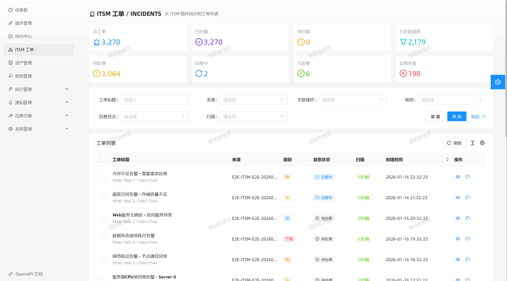

【插件创建向导 — 四步配置流程截图】
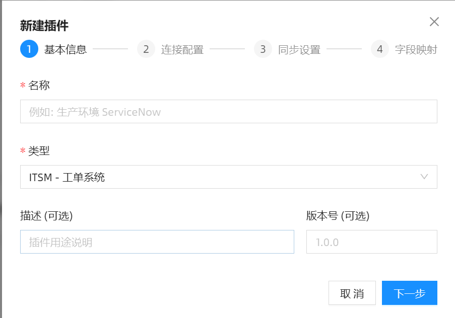
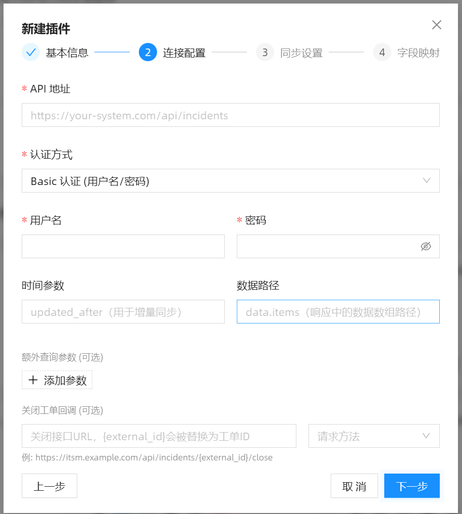
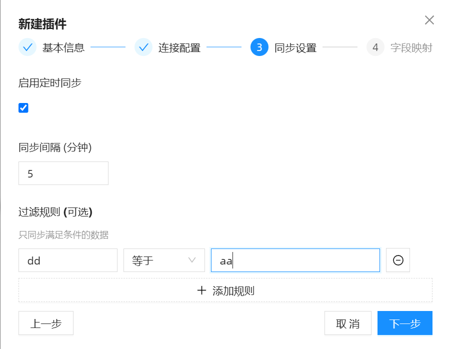
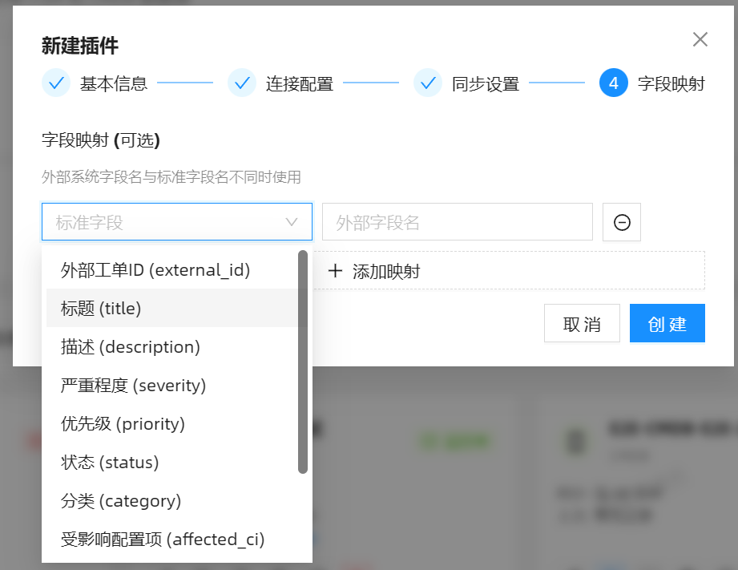

【同步日志详情面板，展示过滤记录和原因说明】
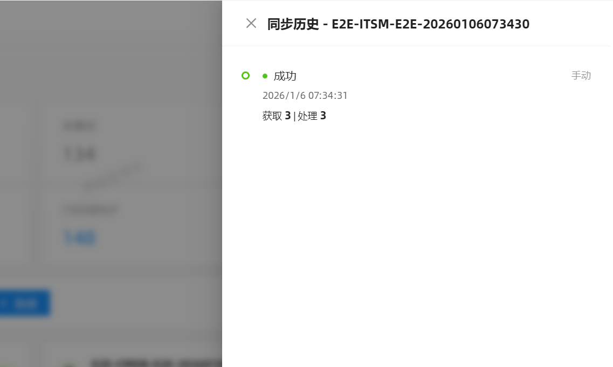
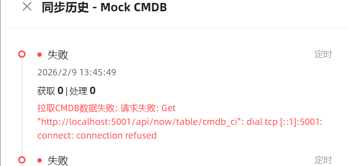

---

### 2.2 资产管理（CMDB）

资产管理模块是平台的基础设施资产台账，为自愈修复提供目标主机信息。

平台对资产实行 3 态生命周期管理：

| 状态 | 含义 | 平台行为 |
|------|------|---------|
| 活跃（active） | 正常在线运行 | 可参与自愈修复和自动扫描 |
| 维护中（maintenance） | 正在进行人工维护或计划维护 | 自动排除自愈操作，窗口到期后自动恢复为活跃 |
| 停用（offline） | 已下线或退役 | 完全不参与任何操作 |

关键特性：

- 维护模式管理：支持手动设置维护窗口（须填写原因，可选设定结束时间），超时后系统自动恢复资产状态。
- 批量连通性测试：选中多台主机一键测试 SSH/网络连通性，结果即时反馈。
- 维护日志审计：完整记录每次维护操作的时间、原因、操作人。
- 批量操作支持：支持批量进入/退出维护模式。

【CMDB 资产列表页面，展示主机状态标签】

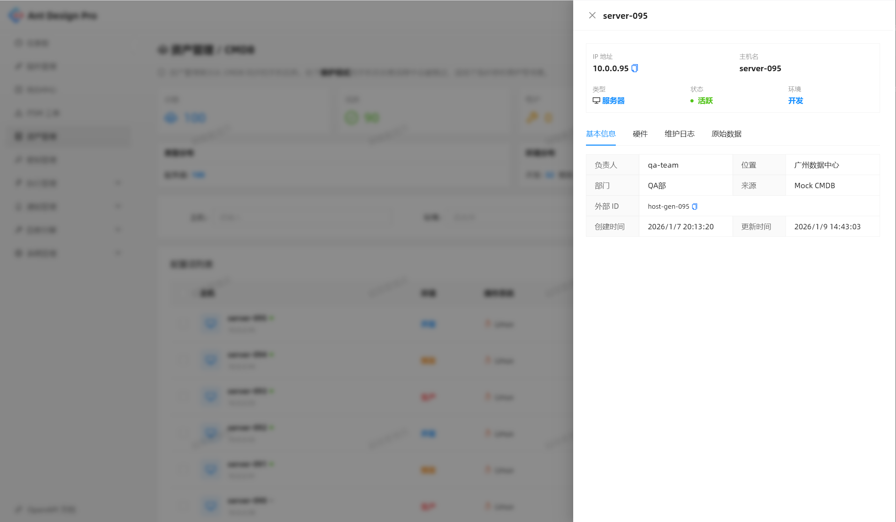

【进入维护模式弹窗（填写原因和计划结束时间）】

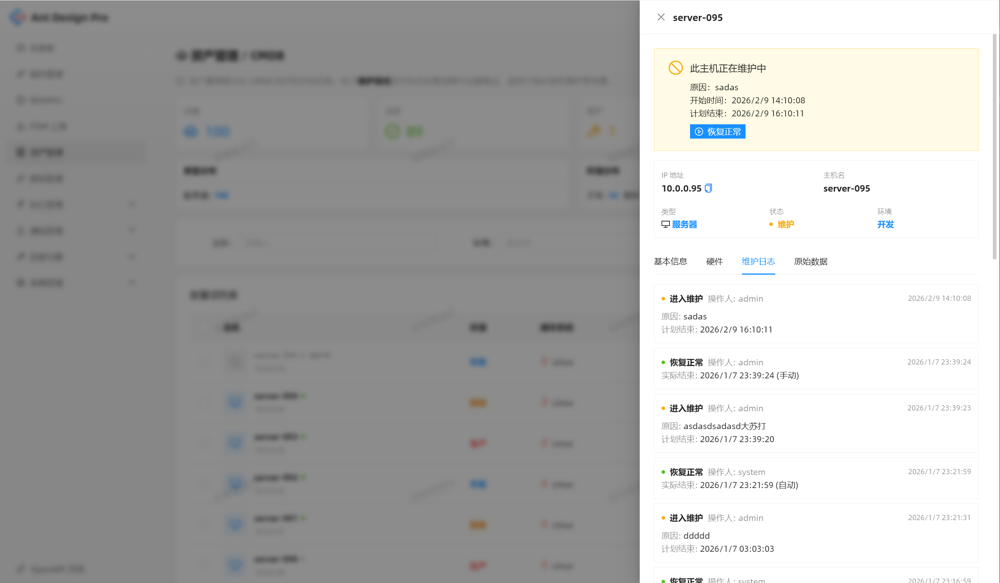

---

### 2.3 密钥管理（安全凭证中心）

集中管理平台执行自动化操作所需的 SSH 密钥、密码、API Token 等敏感凭证。

支持的密钥源类型：

| 类型 | 说明 |
|------|------|
| HashiCorp Vault | 对接企业级密钥管理系统 |
| Webhook | 从外部系统实时获取凭证 |
| 本地文件 | 支持本地密钥文件读取 |

关键特性：

- 多级密钥选择策略：执行时按优先级逐级尝试密钥源，支持默认密钥源自动回退。
- 凭证连通性诊断：选择目标主机一键测试凭证是否可用。
- 临时凭证模式：执行过程中密钥仅临时使用，任务结束后立即清除，零残留。

【密钥管理列表页面，展示不同类型密钥源卡片】
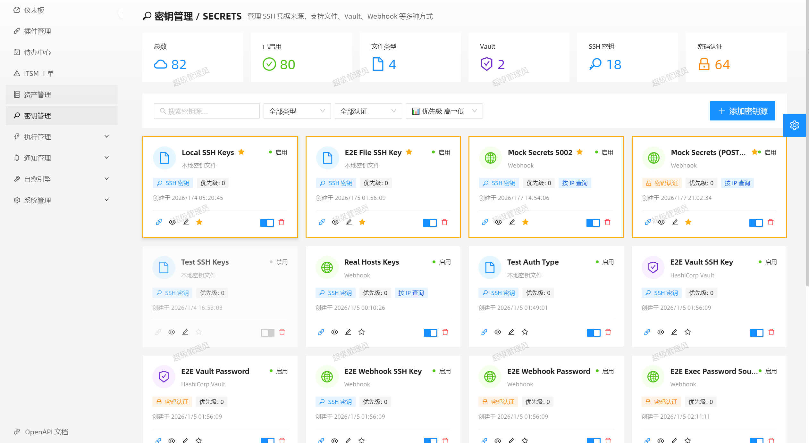

---

### 2.4 Git 仓库管理（代码源管理）

管理自动化脚本（Ansible Playbook）的源代码仓库，确保执行代码来源可追溯。

关键特性：

| 特性 | 说明 |
|------|------|
| 多认证支持 | HTTPS（用户名密码/Token）、SSH（私钥）、公开仓库均支持 |
| 分支自动发现 | 创建仓库时自动探测远程分支列表供选择 |
| 定时自动同步 | 可配置同步间隔，保持本地代码镜像最新 |
| 手动同步 | 一键手动触发代码同步 |
| 文件浏览器 | 在线浏览仓库文件目录和代码内容 |
| 同步日志 | 记录每次同步的操作类型、状态、耗时 |

创建仓库时采用三步向导：连接验证 → 配置选择 → 完成。

【Git 仓库管理列表页面】
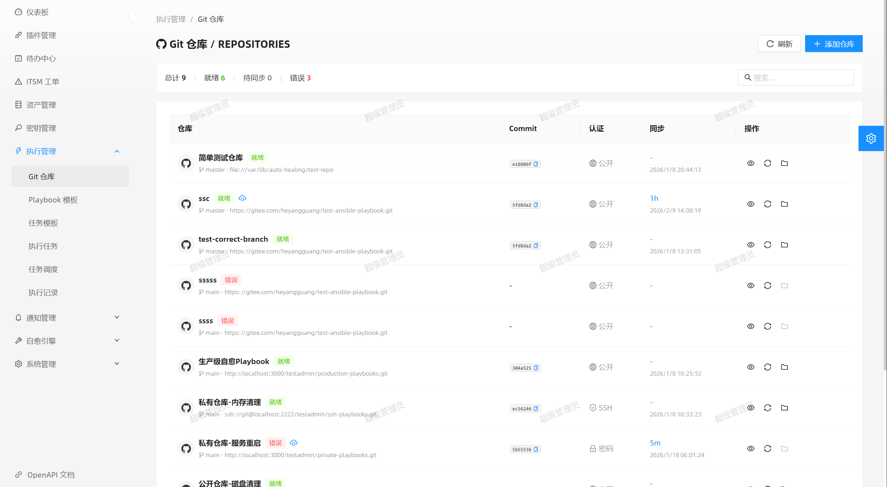

【仓库详情 — 文件浏览器】
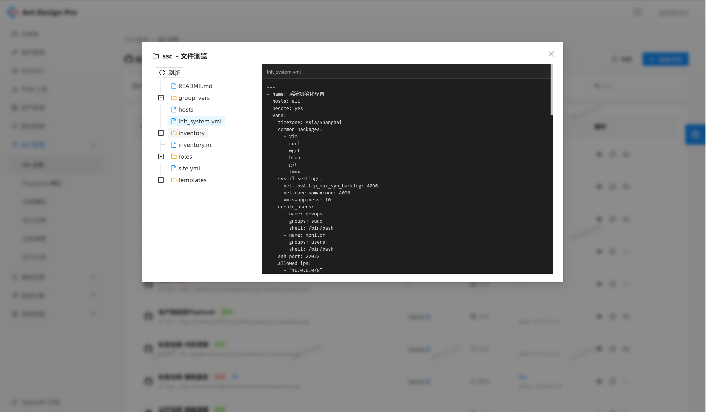

---

### 2.5 Playbook 模板管理（自动化蓝图）

从 Git 仓库中提取 Ansible Playbook，作为可执行的自动化蓝图进行管理。

生命周期：创建 → 变量扫描 → 就绪上线 → 下线维护

关键特性：

- 自动变量扫描：自动分析 Playbook 代码，发现所有变量及其默认值。
- 变量精细化管理：为每个变量设置描述、默认值、类型约束（数值范围、枚举选项等）。
- 下游漂移检测：Playbook 变量变更后，自动标记关联任务模板需要审查，强制确认后方可执行。
- 仓库同步联动：Git 代码更新时自动触发关联 Playbook 重新扫描。

【Playbook 管理工作台（变量管理面板）】

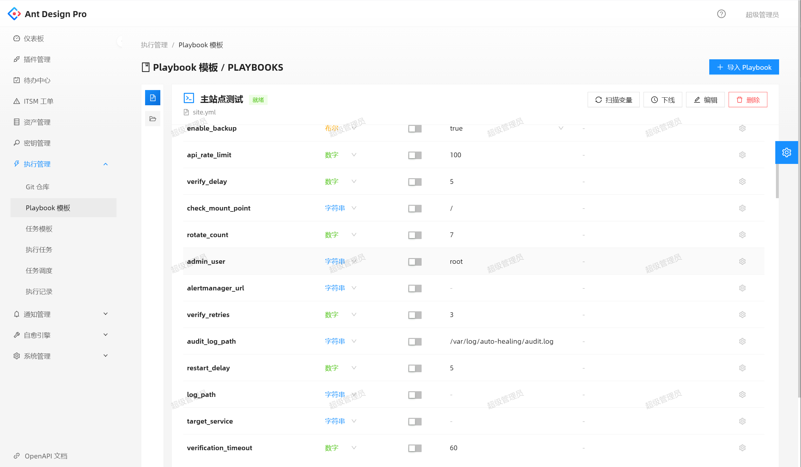

---

### 2.6 执行管理（任务中心）

#### 2.6.1 任务模板

任务模板是平台的最小执行单元，将 Playbook 蓝图与具体的执行参数绑定。

| 配置项 | 说明 |
|--------|------|
| 关联 Playbook | 选择要执行的自动化蓝图 |
| 目标主机 | 从 CMDB 选择或手动指定目标主机/主机组 |
| 密钥源 | 选择执行所需的 SSH 凭证 |
| 额外变量 | 预设执行参数/变量值 |
| 执行器类型 | Local（本地执行）或 Docker（容器化隔离执行） |
| 通知策略 | 按执行状态（开始/成功/失败）独立配置通知渠道和模板 |

【任务模板详情页面】
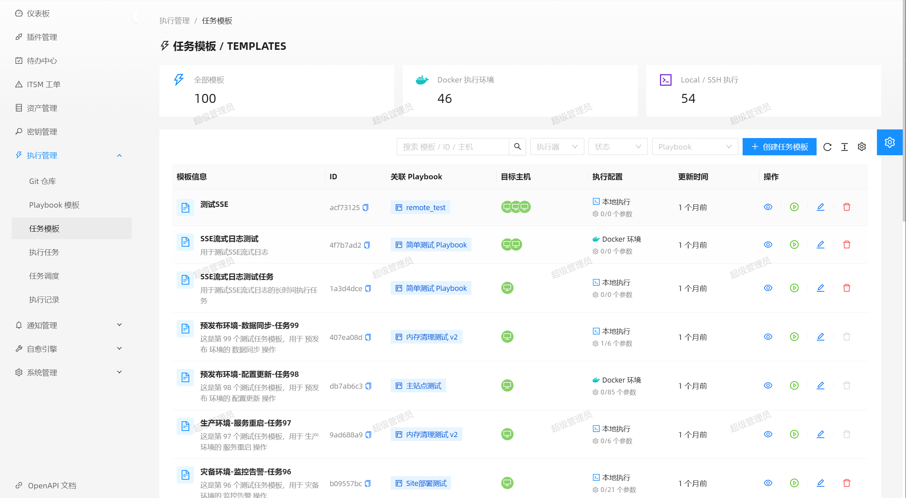

#### 2.6.2 手动执行（任务发射台）

操作员可快速选择模板并一键执行。执行时可临时修改目标主机、变量参数、密钥源等参数。启动后实时查看 Ansible 执行日志输出（无需刷新页面），同时可临时添加额外通知接收人。

【任务发射台界面】
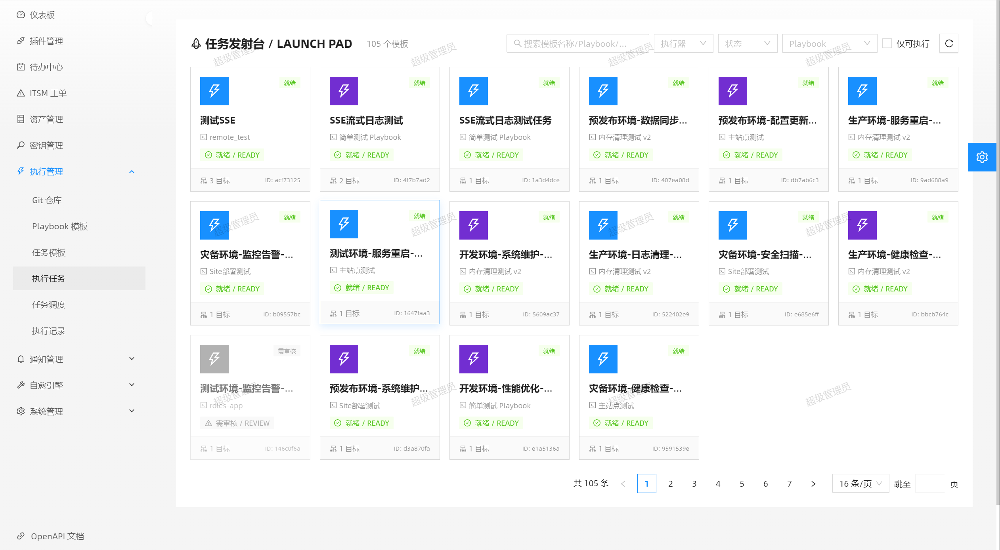

【执行实时日志流】
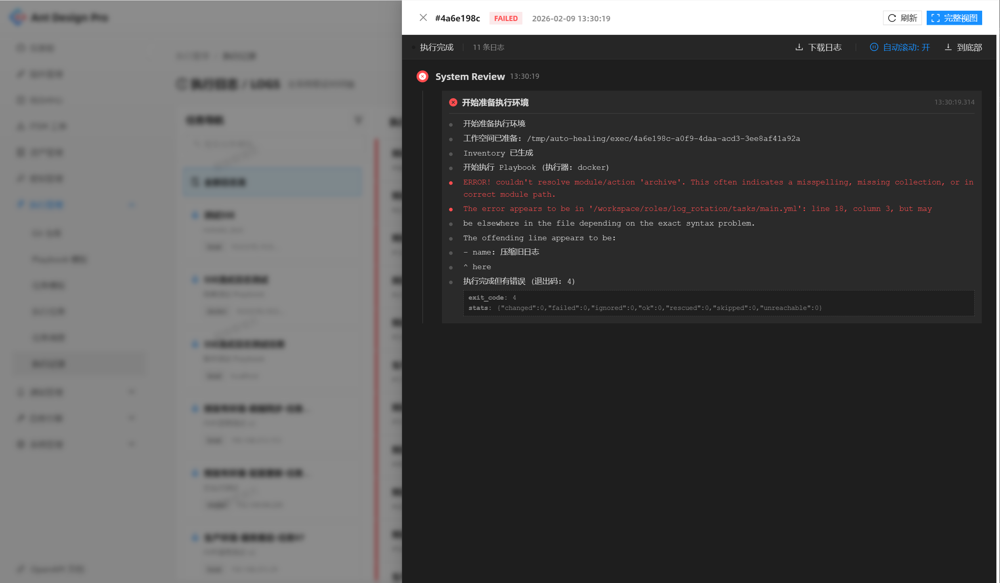

#### 2.6.3 定时任务

支持将任务模板设置为周期性自动执行。提供可视化 Cron 编辑器配置定时策略，支持一次性和周期性调度。每个定时任务可覆盖模板默认参数，支持静默执行（跳过通知）。

【定时任务管理页面】
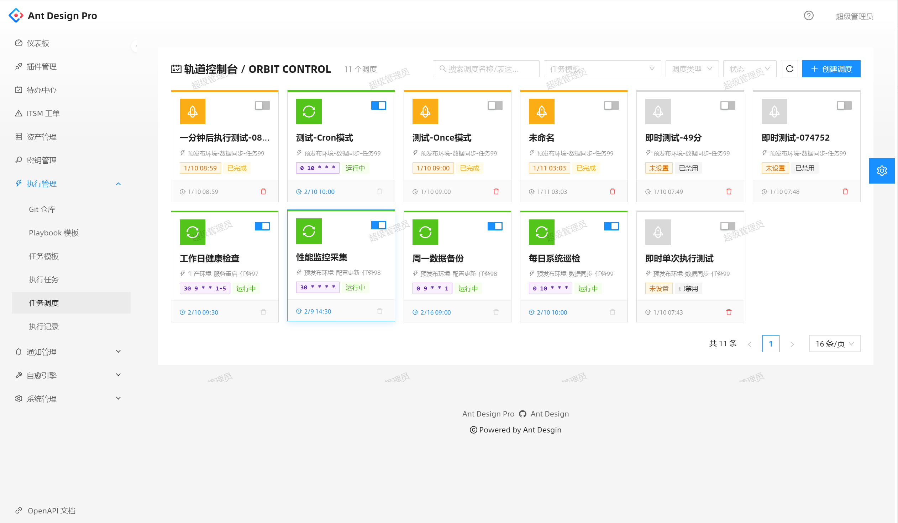

#### 2.6.4 执行记录

所有执行记录（手动/定时/自愈触发）统一存储，提供完整审计能力。支持按模板名、目标主机、触发来源、时间范围、执行状态等多维检索。每条记录清晰标注触发来源（手动/定时任务/自愈规则），可钻取查看完整执行日志。执行结果分为成功/部分成功/失败三态，精确反映多主机场景下的真实情况。

【执行记录列表页面】
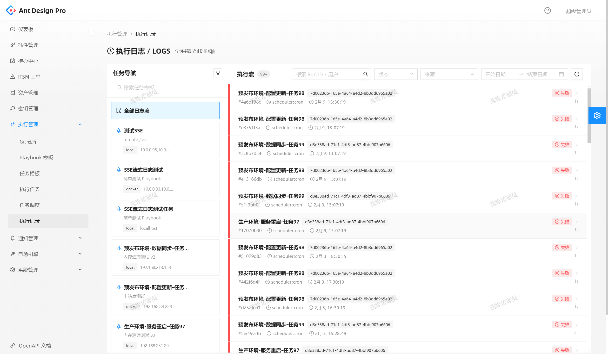

---

### 2.7 自愈中心（核心引擎）

自愈中心是平台的核心模块，实现从告警到修复的全自动化闭环。

#### 2.7.1 自愈规则（告警匹配）

规则定义了"什么样的告警应该触发什么修复流程"。

匹配条件能力：

| 能力 | 说明 |
|------|------|
| 嵌套逻辑 | 支持 AND/OR 条件组的任意嵌套组合 |
| 匹配字段 | 告警标题、级别、分类、配置项、服务名等任意字段 |
| 运算符 | 等于、包含、正则、列表匹配、数值比较等 |
| 优先级机制 | 多条规则命中同一告警时，仅执行最高优先级的规则 |

触发模式：

| 模式 | 说明 |
|------|------|
| 自动执行 | 告警匹配后立即启动修复流程，适用于低风险、高频场景 |
| 人工确认 | 匹配后进入待办中心等待确认，适用于高风险变更 |

规则仿真测试：保存前可使用 Mock 数据或历史工单测试匹配效果，逐条显示每个条件的命中/未命中状态，帮助精准调试。

【自愈规则列表页面】
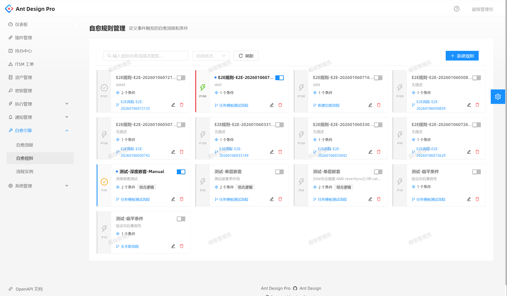

【规则编辑界面 — 嵌套条件配置】
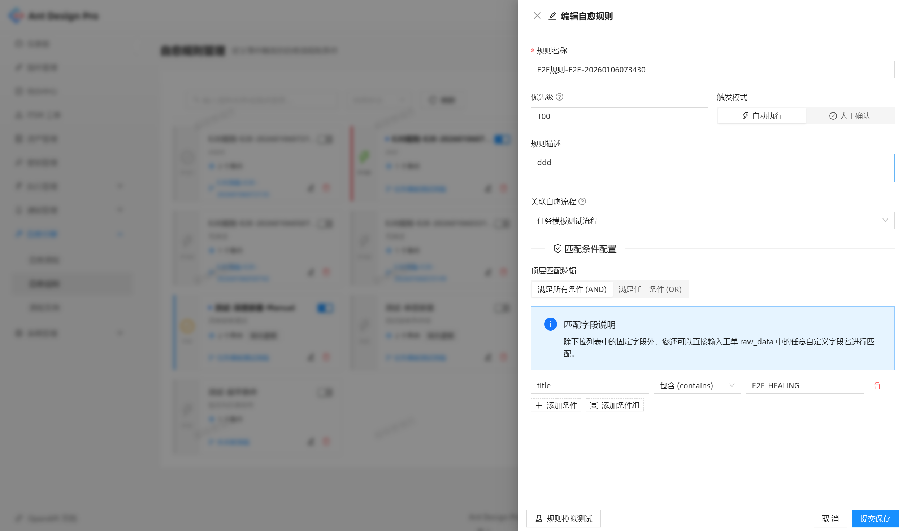

【规则仿真测试结果】

#### 2.7.2 自愈流程（DAG 流程设计器）

流程是一个可视化的 DAG（有向无环图），定义了修复操作的完整执行路径。通过拖拽式设计器编辑，所见即所得。

支持的节点类型：

| 节点类型 | 功能说明 |
|---------|---------|
| 开始 / 结束节点 | 流程入口和出口 |
| 主机提取 | 从告警数据中自动提取受影响的主机/IP |
| CMDB 验证 | 检查目标主机是否在 CMDB 中存在且非维护/停用状态 |
| 条件判断 | 动态分支决策，根据上下文变量走不同路径 |
| 执行节点 | 调用任务模板执行 Ansible Playbook |
| 审批节点 | 流程暂停等待人工审批（支持超时自动拒绝） |
| 通知节点 | 发送通知（支持多渠道同时发送） |
| 变量设置 | 在流程上下文中设置自定义变量 |
| 循环节点 | 对列表数据进行循环操作 |

其他关键能力：

- 动态变量映射：从上下文中提取数据传递给下游节点（如从告警中提取 IP 传递给执行节点）。
- 多分支路径：条件节点和审批节点支持不同结果走不同路径。
- Dry-Run 仿真：在不执行实际操作的前提下模拟整个流程，验证逻辑正确性。

【DAG 流程设计器 — 展示一个完整的自愈流程】
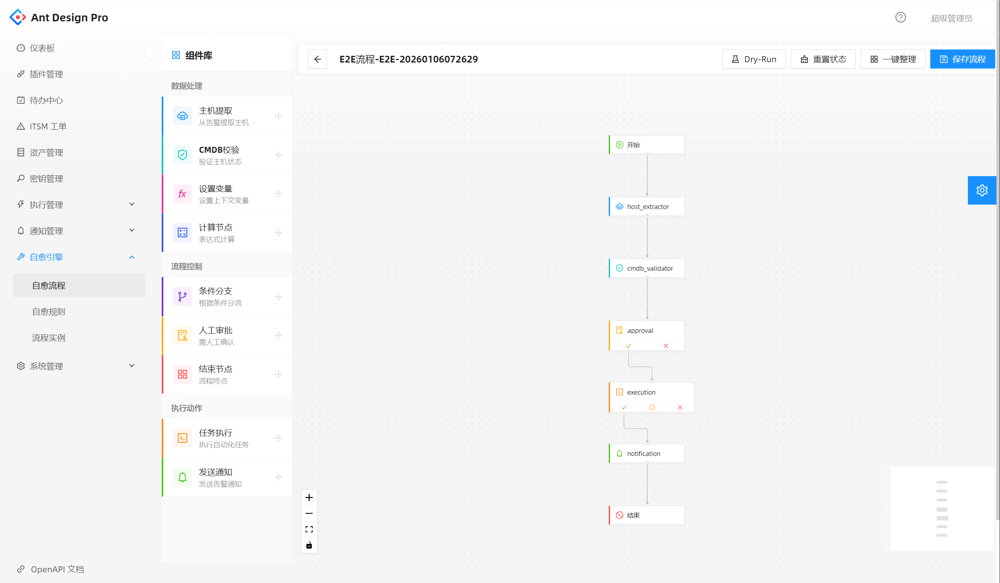

【Dry-Run 仿真执行过程】
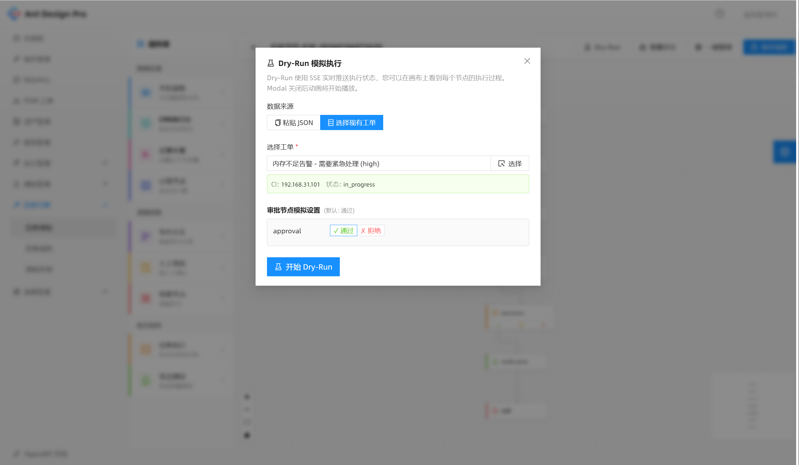
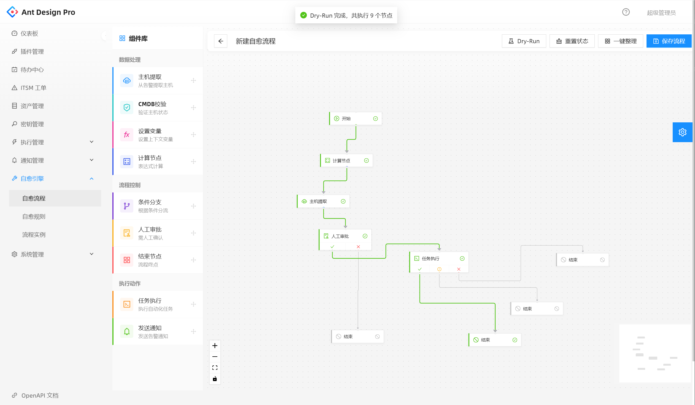

#### 2.7.3 流程实例（执行监控）

每一次自愈流程的执行都会生成一个独立的流程实例。

| 能力 | 说明 |
|------|------|
| 实时状态追踪 | 实时推送节点执行状态（运行中/成功/失败） |
| DAG 可视化回放 | 在流程图上实时高亮当前执行节点和已完成路径 |
| 详细执行日志 | 每个节点的输入、输出、处理过程均有完整记录 |
| 失败重试 | 支持从指定节点重新执行 |
| 手动取消 | 支持终止执行中的流程 |

【流程实例详情 — DAG 图高亮执行路径 + 节点日志面板】
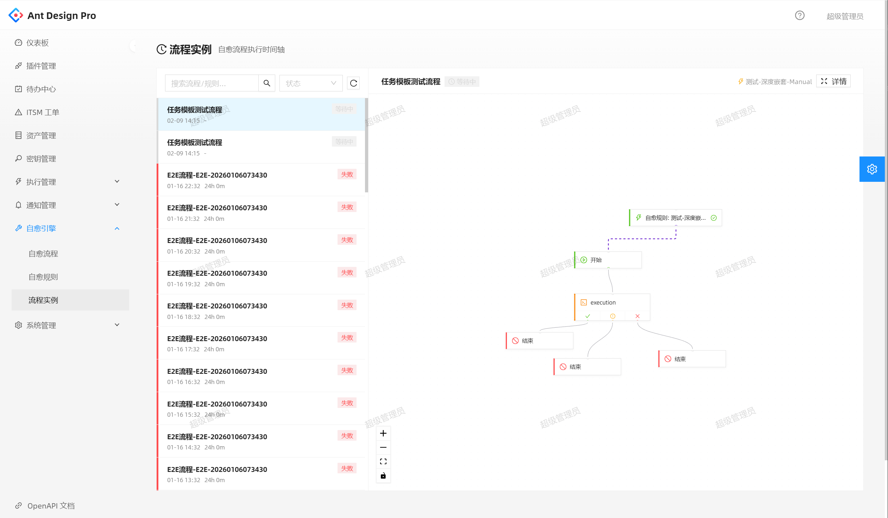

---

### 2.8 待办中心（决策工作台）

待办中心是所有需要人工干预任务的统一入口。

| 任务类型 | 来源 | 操作 |
|---------|------|------|
| 待触发工单 | 匹配了"人工确认"模式规则的告警 | 确认后启动自愈流程 |
| 待审批任务 | 自愈流程中审批节点产生的请求 | 批准或拒绝 |

页面采用双栏布局（左侧待审批、右侧待触发），一屏掌控全局。支持搜索、过滤和一键操作。

【建议插图：待办中心页面 — 双栏布局】
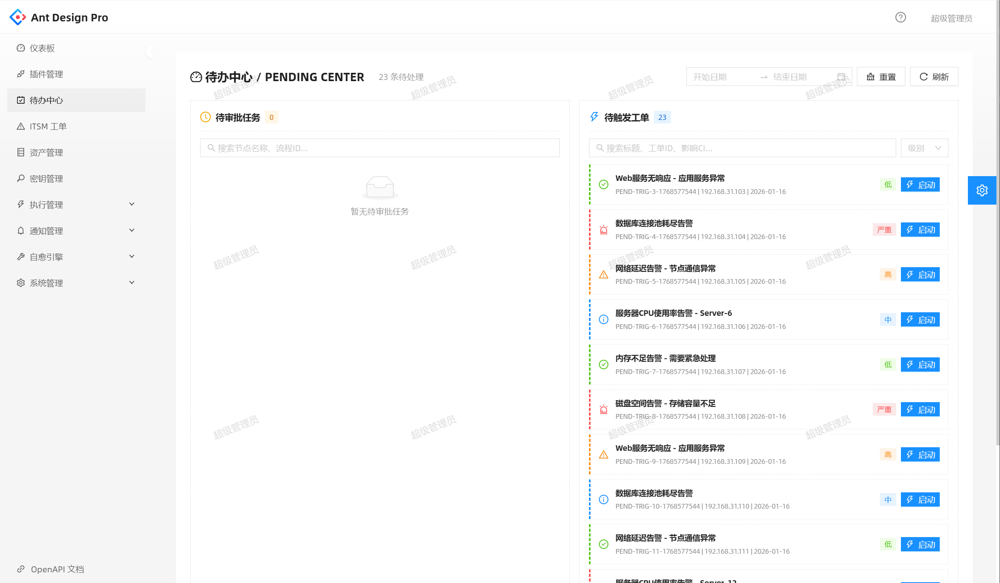

---

### 2.9 通知管理

通知管理实现了触发事件与消息投递的解耦，支持灵活的多渠道告警策略。

（1）通知渠道：支持 Webhook（对接第三方系统）、邮件（SMTP）、钉钉等通信方式。每个渠道独立配置，支持启用/禁用。

（2）通知模板：内置丰富的平台变量（系统信息、执行结果、告警详情等），支持实时预览渲染效果。

（3）通知记录：提供完整投递追踪（待发送 → 投递成功/失败），失败消息自动重试，每条通知关联触发来源便于追溯。

可为任务的不同执行结果（开始/成功/失败）分别配置不同的通知策略。例如：成功时发 Webhook 到监控大屏，失败时同时发邮件 + 钉钉告警。

【通知渠道管理页面】
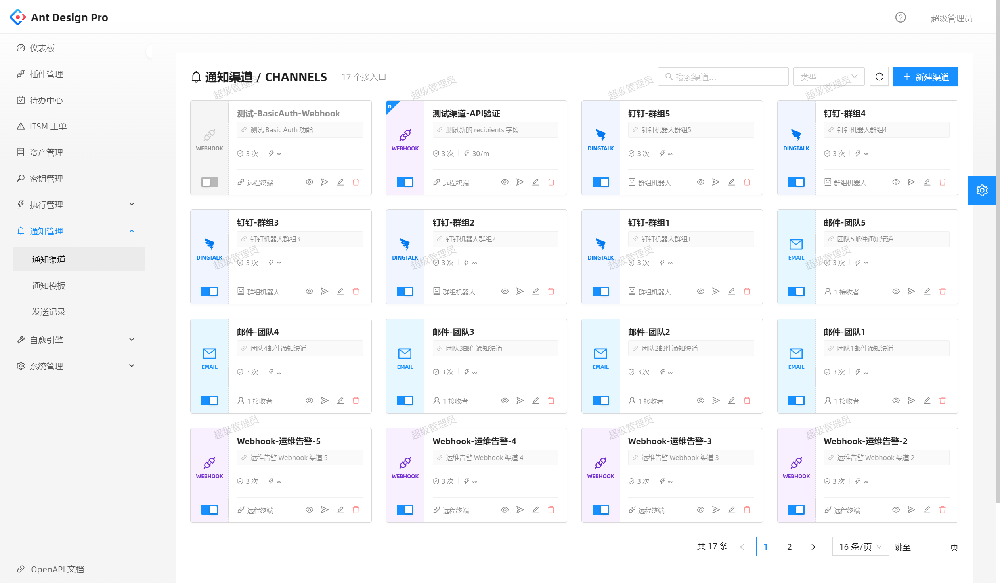

【通知模板编辑（变量插入 + 预览）】
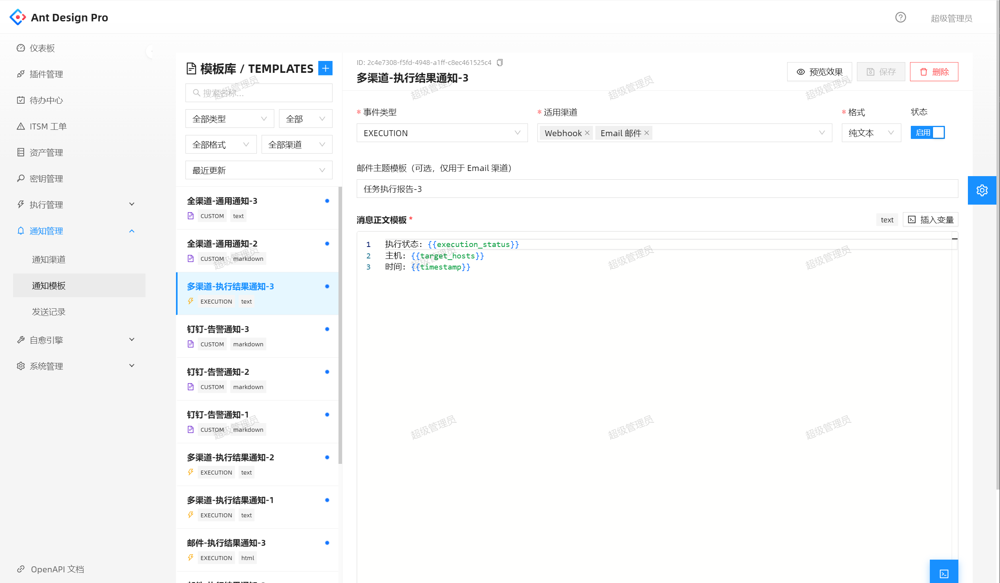

---

### 2.10 用户与权限管理

（1）用户管理：支持本地用户账号创建和管理，可启用/禁用用户状态，提供独立的安全密码重置流程。

（2）角色管理（RBAC）：采用角色-权限绑定模型，支持细粒度权限控制。系统内置角色受保护，防止误删。权限分配采用可视化双列穿梭框操作。

（3）SSO 单点登录（SAML 2.0）：支持对接 ADFS、Azure AD、阿里云 SSO 等企业身份认证系统。首次 SSO 登录自动创建平台账号。提供五种授权策略：

| 授权策略 | 说明 |
|---------|------|
| 开放模式 | 所有 SSO 认证通过的用户均可访问，分配默认角色 |
| 白名单 | 仅允许指定用户名/邮箱的用户访问 |
| 域名限制 | 仅允许指定邮箱域名的用户访问 |
| 角色映射 | 根据 SAML 属性/组自动映射到平台角色（推荐） |
| 混合模式 | 组合上述多种策略使用 |

---

## 三、典型自愈场景

以下展示一个完整的自愈场景从告警到修复的过程：

第一步 — 告警接入：监控系统产生一条"磁盘空间不足"告警。ITSM 插件定时同步，将告警自动拉入平台。

第二步 — 规则匹配：全局调度器自动扫描新告警，匹配到预设规则"磁盘空间告警 → 磁盘清理流程"。

第三步 — 自愈执行：系统自动触发关联的自愈流程，依次执行：主机提取（从告警中获取受影响主机 IP）→ CMDB 验证（确认主机在线且非维护状态）→ 磁盘清理（运行 Ansible Playbook）。如果清理失败，走失败分支进入审批节点，等待人工确认后执行强制清理方案。

第四步 — 结果通知：修复完成后，通过钉钉 + 邮件通知相关运维人员。修复日志完整记录，告警状态自动更新为"已修复"。

全程自动化，无需人工介入（高风险操作可配置为人工审批后执行）。

---

## 四、平台菜单总览

| 一级菜单 | 二级菜单 | 功能说明 |
|---------|---------|---------|
| 仪表盘 | — | 平台运行状态总览 |
| 插件管理 | — | 外部系统数据接入（ITSM/CMDB） |
| 资产管理 | — | 基础设施资产台账 |
| 密钥管理 | — | SSH 密钥 / 密码管理 |
| Git 仓库 | — | 自动化脚本代码源 |
| Playbook 模板 | — | 自动化蓝图管理 |
| 执行管理 | 任务模板 | 最小执行单元配置 |
| | 任务发射台 | 手动执行入口 |
| | 定时任务 | 周期性自动执行 |
| | 执行记录 | 历史执行审计 |
| 自愈中心 | 自愈规则 | 告警匹配策略 |
| | 自愈流程 | DAG 流程设计器 |
| | 流程实例 | 执行监控与日志 |
| 待办中心 | — | 人工决策工作台 |
| 通知管理 | 通知渠道 | Webhook / 邮件 / 钉钉 |
| | 通知模板 | 消息内容配置 |
| | 通知记录 | 投递追踪审计 |
| 用户管理 | — | 用户账号管理 |
| 角色管理 | — | RBAC 角色权限 |
| 应用账户 | — | API 访问凭证 |

---

© 2026 Auto-Healing Platform — 智能运维，让修复自动发生。
